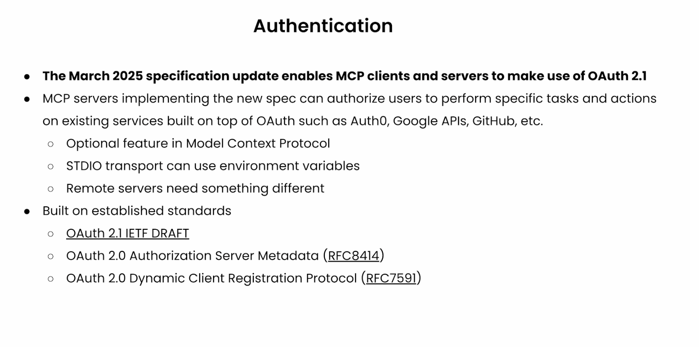
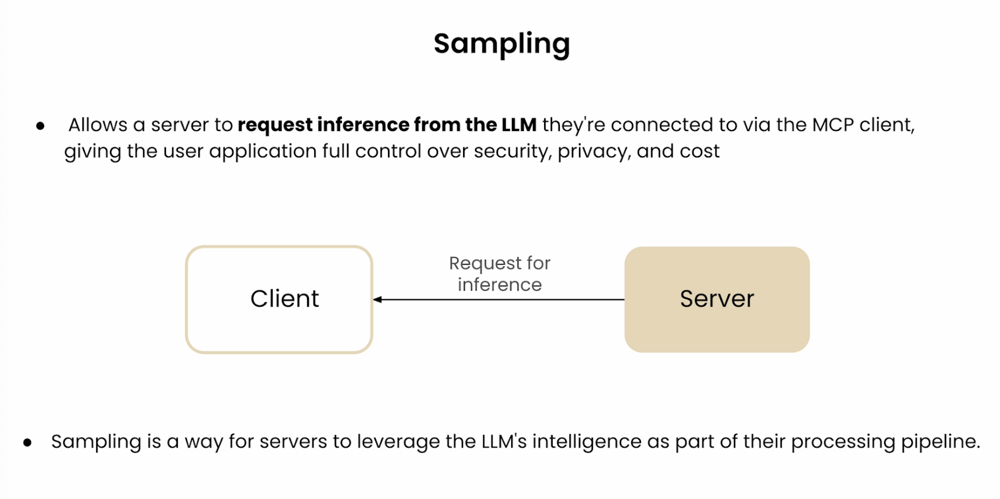

## What's not covered here

### 1. Authentication

### 2. Client Primitives

- Roots

- Sampling

## Building Effective Agents with MCP

- Sampling + Composability

- Unified Registry API

- Self-evolving

- Server Discovery

- And a lot more..
